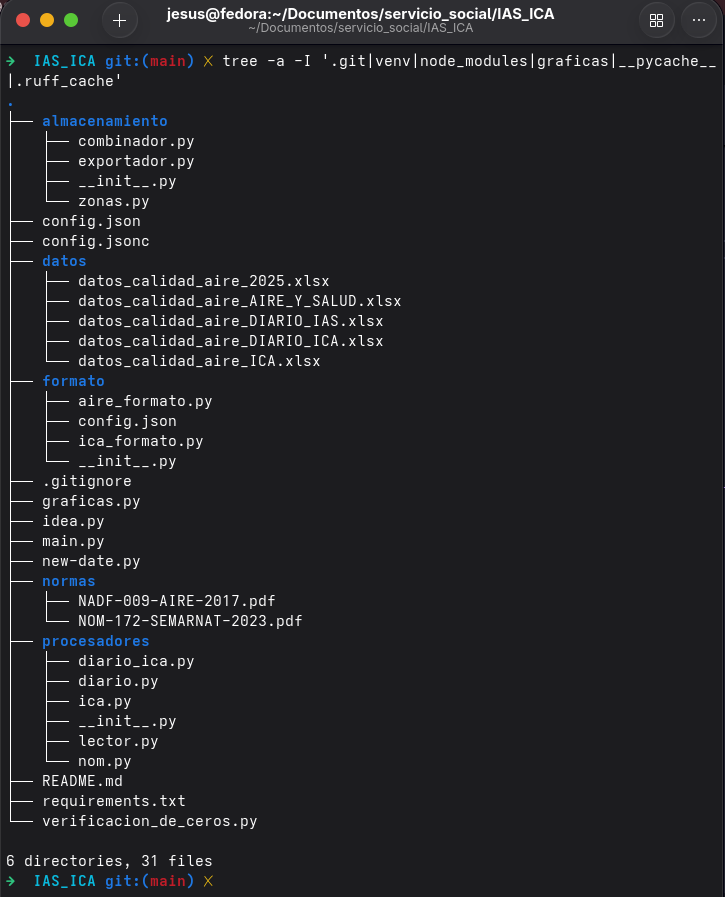

# IAS_ICA – Índice de Calidad del Aire (ICA) e Índice AIRE y SALUD (IAS)

Sistema para el procesamiento de datos horarios y diarios de calidad del aire, cálculo de índices según **NADF-009-AIRE-2017** (ICA) y **NOM-172-SEMARNAT-2023** (IAS), y generación de gráficas.

Desarrollado para la **Secretarias de Medio Ambiente Desarrollo Sustentable y Ordenamiento Territoreal (SMADSOT)** del Estado de Puebla.

---

## Características principales

- Lee archivos Excel con estructura variable (detecta automáticamente estaciones, contaminantes y unidades).
- Corrige fechas con hora `24:00` y año incorrecto.
- Calcula **ICA horario y diario** (NADF-009).
- Calcula **IAS horario y diario** (NOM-172).
- Aplica **NowCast de 12h** para PM10 y PM2.5.
- Permite **suficiencia configurable** para promedios.
- Combina datos nuevos con históricos sin duplicados.
- Exporta múltiples archivos Excel organizados por:
  - General
  - Estación
  - Zona geográfica
- Aplica formato condicional automático.
- Genera más de **115 gráficas** listas para reportes oficiales.

---

## Estructura del proyecto



---

## Instalación

1. **Clonar o descargar** el repositorio.

2. **Crear un entorno virtual** (opcional pero recomendado):

```bash
python -m venv venv

# Linux / Mac
source venv/bin/activate

# Windows
venv\Scripts\activate
```

3. **Instalar dependencias**:

```bash
pip install -r requirements.txt
```

4. Verificar que el archivo `config.json` se encuentra en la raíz del proyecto.

---

## Uso básico

### 1. Procesar nuevos datos

```bash
python main.py
```

El sistema:

- Solicita seleccionar un archivo Excel.
- Procesa automáticamente todas las hojas, (el archivo debe tener la plantilla de las estaciones de monitoreo).
- Detecta estaciones y contaminantes.
- Combina datos nuevos con históricos.
- Actualiza los archivos acumulativos dentro de la carpeta `datos/`.

### Formato esperado del archivo de entrada

- Filas iniciales con metadatos:
  - estaciones
  - contaminantes
  - unidades
- Columna principal:
  - `Fecha & Hora`
  - formato `DD/MM/YYYY HH:MM`
- Opcional:
  - columna `Status`
  - valor `"Ok"` para datos válidos

El sistema detecta automáticamente la estructura del archivo.

---

### 2. Generar gráficas

```bash
python graficas.py
```

Genera automáticamente gráficas en la carpeta `graficas/`.

Incluye:

- ICA horario
- ICA diario
- IAS diario
- Concentraciones con límites NOM
- Correlaciones
- Diagramas de dispersión
- Barras apiladas
- Perfiles horarios

Las imágenes se exportan en formato PNG a 150 dpi.

---

### 3. Scripts auxiliares

#### Verificación de ceros

```bash
python verificacion_de_ceros.py
```

Busca valores cero exactos en columnas `CANTIDAD_*`.

---

#### Corrección de fechas

```bash
python new-date.py
```

Permite cambiar años en archivos de Excel, solo para uso de prueba.

---

## Configuración (`config.json`)

El archivo `config.json` centraliza los parámetros configurables del sistema.

| Sección | Descripción |
|---|---|
| `NADF` | Configuración ICA |
| `NOM` | Configuración IAS |
| `suficiencia` | Fracción mínima de datos válidos |
| `orden_categorias` | Orden de categorías |
| `unidades_display` | Unidades mostradas |
| `zonas` | Agrupación geográfica |
| `colores` | Colores de categorías |

---

## Archivos de salida

Todos los archivos se almacenan en la carpeta `datos/`.

| Archivo | Contenido |
|---|---|
| `datos_calidad_aire_ICA.xlsx` | ICA horario |
| `datos_calidad_aire_AIRE_Y_SALUD.xlsx` | IAS horario |
| `datos_calidad_aire_DIARIO_IAS.xlsx` | IAS diario |
| `datos_calidad_aire_DIARIO_ICA.xlsx` | ICA diario |

Cada archivo incluye:

- Hoja general
- Hoja por estación
- Hoja por zona
- Formato condicional automático

---

## Dependencias principales

- `pandas`
- `numpy`
- `openpyxl`
- `matplotlib`
- `tkinter`

---

## Notas importantes

- Valores `<= 0` se convierten automáticamente en `NaN`.
- La hora `24:00` se corrige automáticamente.
- PM10 y PM2.5 utilizan el algoritmo oficial **NowCast**.
- La suficiencia por defecto es `0.75`.

---

## Personalización

### Agregar zonas

Editar:

```json
"zonas"
```

dentro de `config.json`.

---

### Cambiar colores

Modificar:

```json
"colores"
```

---

### Ajustar límites normativos

Modificar:

```json
"bandas"
```

---

## Ejemplo de ejecución

### Procesamiento de datos

```bash
python main.py
```

Salida esperada:

```bash
Procesando hoja "2025-01"
Generando archivos Excel...
Proceso completado correctamente
```

---

### Generación de gráficas

```bash
python graficas.py
```

Salida esperada:

```bash
Cargando datos...
Generando gráficas...
✓ 128 gráficas guardadas en 'graficas/'
```

---

## Solución de problemas

| Problema | Posible causa | Solución |
|---|---|---|
| No se encuentra `config.json` | Archivo faltante | Copiar `config.jsonc` |
| Fechas incorrectas | Hora `24:00` | Ejecutar `new-date.py` |
| Ceros en `CANTIDAD_*` | Redondeo | Comportamiento esperado |
| Error de memoria | Excel muy grande | Dividir archivo |

---


## Normativas implementadas:

- **NADF-009-AIRE-2017**
- **NOM-172-SEMARNAT-2023**
- **NOM-020**
- **NOM-021**
- **NOM-022**
- **NOM-023**
- **NOM-025-SSA1**

---

**Última actualización:** Mayo 2026